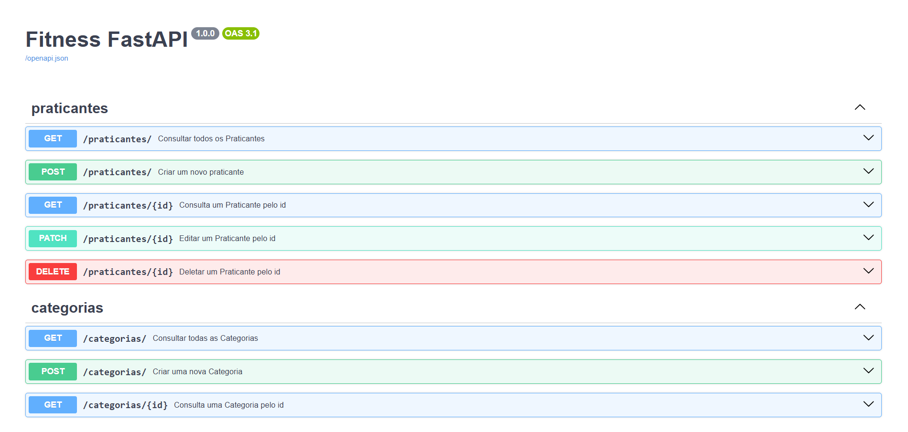

# 🏋️‍♂️ fitness-fastapi


API para gerenciamento de categorias, praticantes e centros de treinamento — construída com FastAPI, SQLAlchemy, PostgreSQL e Alembic.

## 📌 Sobre o projeto

**fitness-fastapi** é uma API simples e prática criada para estudos — unindo duas paixões:  
codar e treinar.  

Ela contém algumas tabelas principais:

- 🏋️ Categorias  
- 🧍‍♂️ Praticantes  
- 🏢 Centros de Treinamento  

O objetivo é aprender:

- FastAPI (async)
- SQLAlchemy ORM moderno
- Alembic para migrations
- Docker + Postgres
- Boas práticas de projeto

---

## 🧰 Stack utilizada

| Camada     | Tecnologia              |
| ---------- | ----------------------- |
| Framework  | FastAPI (async)         |
| ORM        | SQLAlchemy 2.0          |
| Validação  | Pydantic                |
| Migrations | Alembic                 |
| Banco      | PostgreSQL (via Docker) |
| Ambiente   | Python 3.12+            |

--- 
## ▶️ Execução do projeto
### 1️⃣ Criar ambiente virtual
```
python3 -m venv .venv
source .venv/bin/activate
pip install -r requirements.txt
```


### 2️⃣ Subir o banco (Docker)
```
make run-docker
```

### 3️⃣ Criar e rodar migrations

Criar uma migration:

```
make create-migrations d="nome_da_migration"
```

Rodar migrations:

```
make run-migrations
```

### 4️⃣ Subir a API
```
make run
```

Acesse a documentação:

📌 http://127.0.0.1:8000/docs

--- 

## 📷 Preview da 



---

## 🏆 Desafios

- Adicionar Query Parameters para praticantes (nome, cpf)
- Customizar responses de endpoints
- Manipular exceções de integridade (IntegrityError)
- Adicionar paginação (fastapi-pagination) com limit e offset


---
## 👩‍💻 Autora
Feito com ❤️ por [Jezebel Guedes](https://www.linkedin.com/in/jezebel-guedes/) 👋Vamos nos conectar!